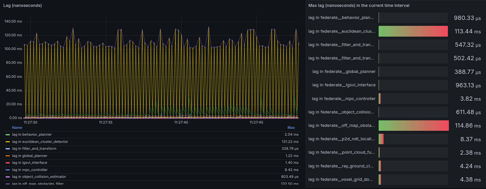
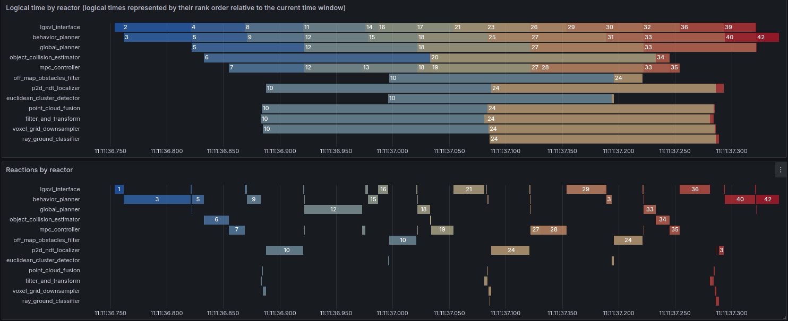
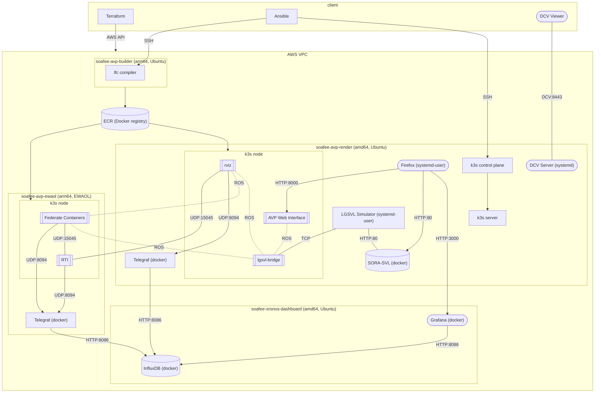

# SOAFEE Blueprint AVP Demo

A fully-executable SOAFEE Blueprint, sponsored by DENSO International America, Inc.

This blueprint runs the Autoware.Auto Autonomous Parking Vehicle (AVP)
demo in Amazon AWS EC2.

The AVP applicaton demonstrates digital twins, edge & cloud computing,
provisioning, configuration and deployment tools, virtualization, orchestration,
and software tools used in the development of software-defined vehicles.

This is the first release of this blueprint and we expect it will evolve
over time. This blueprint illustrate concepts, serves as a launching point
for future explorations and development, and invites feedback from the
SOAFEE Consortium. It is not intended for production use.

Video of this demo: [https://youtu.be/hbjjRoyQ0Cw?si=EgdreEjWDr6FIReu](https://youtu.be/hbjjRoyQ0Cw?si=EgdreEjWDr6FIReu)

Source code of the demo software: [DensoSVIC/soafee-avp-demo](https://github.com/densosvic/soafee-avp-demo)

Overview of the Lingua Franca port of the Autoware.Auto AVP Demo: [Predictable Coordination for Safety-Critical Real-Time Systems ](https://www.youtube.com/watch?v=3NHjQLIYVK4)

## Features

- Provisions an AWS Virtual Private Cloud (VPC)
- Provisions the following EC2 instances:
  - amd64 rendering instance with GPU
  - ARM Graviton EWAOL instance for on-vehicle computing
  - ARM Graviton instance for building applications
  - amd64 instance with database and web-based analytics
- Configures instances with software packages and source code
- Cloud-based simulation and rendering

### Additional Features

- Automatically build an EWAOL AMI
- Teams may share a deployment, and multiple users may independently customize and run the demo
- Multiple cloud deployments may be evaluated without colliding

## Technology Overview

| Category                | Tool |
|-------------------------|------|
| Cloud Services Provider | [Amazon AWS](https://aws.amazon.com) |
| Provisioning            | [Terraform](https://www.terraform.io) |
| Configuration           | [Ansible](https://www.ansible.com) |
| Containerization        | [Docker](https://www.docker.com), [containerd](https://containerd.io) |
| Container Registry      | [Docker Hub](https://hub.docker.com), [Amazon Elastic Container Registry](https://aws.amazon.com/ecr/) |
| Deployment              | [Ansible](https://www.ansible.com), [k3s](https://k3s.io) |
| Edge Layer              | Edge Workload Abstraction and Orchestration Layer ([EWAOL](https://gitlab.com/soafee/ewaol/meta-ewaol)) |
| Operating Systems       | [Linux](https://www.kernel.org), [Yocto](https://www.yoctoproject.org) |
| Distributed Orchestration | [Lingua Franca](https://lf-lang.org) |
| Programming Languages   | C, C++, [Python](https://www.python.org/) |
| Middleware              | [ROS](https://www.ros.org), [CycloneDDS](https://github.com/eclipse-cyclonedds/cyclonedds) |
| Observability           | [InfluxDB](https://www.influxdata.com), [Telegraf](https://www.influxdata.com/time-series-platform/telegraf), [Grafana](https://grafana.com) |
| Simulation              | [LG SVL Simulator](https://github.com/lgsvl/simulator/tree/release-2021.1) |

## Requirements

### Host System

- Compatible operating system:
  - Ubuntu 22.04 or 24.04 (WSL included)
  - OSX Sonoma or later (possibly earlier)
- Docker
- SSH client
- NICE-DCV client

### AWS Account

- The provisioning steps require administrator access to your AWS account.
- An EC2 compute-optimized instance with a GPU is provisioned. The default instance type is g5.4xlarge, which allocates
    16 virtual CPUs (vCPUs). You may need to submit a quota increase request to AWS to increase your vCPU quota to 16 vCPU for G instance types.
- EC2 instances are provisioned with persistant IP addresses (Elastic IPs). This is important because tools like Kubernetes
    are configured to talk to each other using these addresses. You will need 4 EIPs; if you need more, you can submit an AWS quota increase for VPC EIPs.

## How to Use

### Summary of all steps

1. Prepare your AWS credentials
2. Install prerequisites
3. Provision your cloud: `blueprint provision`
4. Configure a user on your EC2 instances: `blueprint init-user`
5. Configure your EC2 instances: `blueprint configure`
6. Build the AVP demo: `blueprint build`
7. Connect to the remote desktop
8. Start the AVP demo: `blueprint start`
9. Stop or restart the AVP demo: `blueprint stop`
10. Deconfigure the container registry: `blueprint deconfigure`
11. Shut down your EC2 instances
12. Destroy your cloud: `blueprint deprovision`

We expect the runtime of this bluebook through a completed parking demo is about 2 hours.

### 1. Prepare your AWS Credentials

Create the file `terraform/variables-secret.auto.tfvars` and populate it with your AWS credentials.

```yaml
aws_access_key = ""  # <-- your access key
aws_secret_key = ""  # <-- your secret key
```

Your credentials need to have the following AWS IAM Policies:

- AdministratorAccess

The default region is `us-east-1`. See [doc/ewaol-ami](doc/ewaol-ami.md) for more information about supported regions.

### 2. Install prerequisites

Install [Docker Engine](https://docs.docker.com/engine/install/) or [Docker Desktop](https://docs.docker.com/desktop/).

Download and install [NICE-DCV Client](https://docs.aws.amazon.com/dcv/latest/userguide/client.html). This is the remote desktop client to the running AVP render instance.

### 3. Provision your Cloud

This step provisions cloud services, creating your virtual private cloud (VPC), EC2 instances and security. AWS administrative credentials are required for this step.

```shell
blueprint provision
```

The following EC2 instances are configured:

- `soafee-avp-render`: amd64 Ubuntu 24.04 server on a high-powered compute-optimized EC2 instance with amd64 processors and an NVIDIA GPU.
- `soafee-avp-ewaol`: arm64 EWAOL instance on a burstable Amazon Gravitron processor.
- `soafee-avp-builder`: arm64 Ubuntu 24.04 server on a burstable Amazon Gravitron processor.
- `soafee-xronos-dashbaord`: amd64 Ubuntu 24.04 server on a cost-effective general-purpose amd64 instance.

**Note: These scripts provision powerful compute instances in EC2. When not using, shut them down to save costs.**

This step is idempotent and safe to run against an already configured cloud. It stores SSH keys in the `instances` folder.

### 4. Configure a user on your EC2 instances

```shell
blueprint init-user
```

The step connects to your EC2 instances for the first time and configures the default user `avp` with password `linguafranca`. The user `avp` is saved to your machine for use in the remaining steps. AWS administrative credentials are required.

This step is idempotent as long as the active user is not changed.

### 5. Configure your EC2 instances

```shell
blueprint configure
```

This step configures EC2 instances with software packages, source code and configuration to run the AVP demo. This step may take 20-30 minutes, as Ubuntu Desktop takes a fair amount of time to install on the render instance.

This step is idempotent and safe to run against already configured instances.

### 6. Build the AVP Demo

```shell
blueprint build
```

The build step compiles Autoware.Auto openadkit v1 and a Lingua Franca implementation of the AVP demo. This step may take 30-45 minutes, as openadkit installs the many dependencies that are needed by ROS.

You only need to rebuild if you have changed the source code for the application.

### 7. Connect to the Remote Desktop

Find the IP address of `soafee-avp-render` with the command `blueprint show-hosts`.

Open DCV Viewer on your desktop and connect to the running instance:

```shell
avp@<IP address of avp-render>#avp
```

Password: `linguafranca`

Here, the first `avp@` is the user account used to log in. The second `#avp` is the name of the DCV session to connect. The name of the DCV session has been set to your username.

If you are using a user other than the default user, replace `avp` with your username, and use the password that was set when creating the account.

### 8. Start the AVP Demo

```shell
blueprint start
```

To run the demo:

1. LG SVL Simulator will open in the desktop. In the DCV remote desktop session press the Play button in LGSVL Simulator.
1. The web-based observability tool Grafana will open in Firefox. Log in with the default credentials: `admin:linguafranca`.
1. An Autoware.Auto interface for the AVP demo will open in Firefox. Press "Initial pose" button to set the initial position of the car in the scene (otherwise its map will not be localized and it will be unable to navigate). You will see the map re-align to the current position of the car.
1. In the Autoware.Auto interface for the AVP Demo, press "Reverse park" to set the goal for the vehicle. The car should then begin to autonously navigate.
1. Return to the Grafana tab in Firefox to view performance data about the software executing on the EWAOL instance.

The demo is complete when the car has successfully parked in its goal parking space.

### 9. Stop or Restart the AVP Demo

```shell
blueprint stop
```

Will terminate the application, close LG SVL Simulator, close Firefox, and scale-down the kubernetes deployment.

To restart (stop and start) the application,

```shell
blueprint restart
```

### 10. Deconfigure the Container Registry

During the build step, Docker images were pushed to Amazon ECR. To remove these images,

```shell
blueprint deconfigure
```

### 11. Shut Down your EC2 Instances

When you are done running the demo, shut down the instances using either SSH or the AWS EC2 web interface. This ensures you are not billed for additional time on EC2.

**WARNING:** If you are not an AWS administrator, you will not be able to restart these instances once they have been shut down.

```shell
blueprint show-hosts
blueprint shell soafee-avp-render 'sudo shutdown -h now'
blueprint shell soafee-avp-ewaol 'sudo shutdown -h now'
blueprint shell soafee-avp-builder 'sudo shutdown -h now'
blueprint shell soafee-xronos-dashboard 'sudo shutdown -h now'
```

If you have shut down the EC2 instances, you will need to restart them using the AWS EC2 web interface.

### 12. Destroy your Cloud

When you are done exploring the blueprint, or if you would like to configure a new deployment, you may destroy all of the cloud resources:

```shell
blueprint destroy
```

## Exploring the Blueprint

### About Lingua Franca

Lingua Franca offers a straightforward way to write multi-threaded applications that ensure determinism by default, eliminating concerns about thread management, synchronization, and race conditions.

Lingua Franca (LF) is an open-source polyglot coordination language built to enrich mainstream target programming languages (currently C, C++, Python, TypeScript, and Rust) with deterministic reactive concurrency and the ability to specify timed behavior. LF is supported by a runtime system that is capable of concurrent and distributed execution of reactive programs that are deployable on the Cloud, the Edge, and even on bare-iron embedded platforms.

The software controlling the automomous vehicle in the AVP Demo is orchestrated in Lingua Franca. You can see the source code by connecting to the remote desktop, or by connecting to a Remote SSH session in Visual Studio Code.

Read more about Lingua Franca at [https://www.lf-lang.org](https://www.lf-lang.org).

### Observability

Lingua Franca uses tracing to record the execution of the distributed AVP demo
application. Its tracepoints are stored an InfluxDB database on the `soafee-xronos-dashboard`
instance.

A distributed binary in Lingua Franca is referred to as a `federate`.

Tracepoints are queried and monitored using Grafana, a web-based querying and analytics tool.

When running the demo, Grafana will automatically open in Firefox, and trace data should be visible.

See [xronos-inc/xronos-dashboard](https://github.com/xronos-inc/xronos-dashboard) for details on how to use the Xronos Dashboard.

#### Lag

 Several panels visualize the lags experienced by the different federates . A federation that is overloaded will typically exhibit growing lags. For instance, as the car makes the 90-degree turn around halfway through the demo you can clearly see an increase in lag in the federates involved in the LIDAR processing pipeline.

#### Reaction Execution

 These Gantt panels visualize the
advancement of logical time within each federate. Here we can quickly understand which federates consume the most CPU time as well as gauging the general load on the federation.

### Connect with Visual Studio Code

Using the Remote SSH plugin in VS Code, connect to the public IP address of `soafee-avp-render`. You may find the address by executing `blueprint show-hosts`.

#### Monte Carlo Example

The Monte Carlo Example is a small example program in Lingua Franca and Python that verifies the `lfc` compiler and your connection to the Xronos Dashboard.

"Monte Carlo Pi" [xronos-inc/example-monte-carlo-pi](https://github.com/xronos-inc/example-monte-carlo-pi) is cloned to your home directory by the configure step. See `README.md` in the repository for instructions on how to run, and the file `links.md` in the clone of the repository which contains links to web UIs. A Python virtual environment is configured in `example-monte-carlo-pi/.venv` with requirements installed.

#### AVP Demo Source Code

The AVP Demo source code is located on the remote instances in the home directory for your user.

Source code is built natively on two separate instances, the render instance (amd64) and the builder instance (arm64). We recommend forking the source repository and modifying the variables in [ansible/group_vars/version.yml](ansible/group_vars/version.yml) to use this repository. The build step will automatically pull the latest from this repository.

The configuration and build scripts will automatically use SSH agent forwarding if it has been configured on your host. This allows the remote instances to pull from private GitHub repositories.

More about SSH agent forwarding:

- [Using SSH Agent Forwarding](https://docs.github.com/en/authentication/connecting-to-github-with-ssh/using-ssh-agent-forwarding)
- [SSH Agent Forwarding cheatsheet](https://gist.github.com/jezeniel/031a93a7fa73c77fb4a2)

## Architectural Overview



## Troubleshooting

See [toubleshooting](doc/troubleshooting.md).

## Running on Local Machines

See [on-premise](doc/on-premise.md).

## References

### EWAOL References

1. [https://github.com/aws4embeddedlinux/meta-aws-ewaol](https://github.com/aws4embeddedlinux/meta-aws-ewaol)
1. [https://aws.amazon.com/blogs/industries/building-an-automotive-embedded-linux-image-for-edge-using-arm-graviton-yocto-project-soafee/](https://aws.amazon.com/blogs/industries/building-an-automotive-embedded-linux-image-for-edge-using-arm-graviton-yocto-project-soafee/)
1. [https://gitlab.com/soafee/ewaol/meta-ewaol-machine/-/blob/kirkstone-dev/meta-ewaol-ext/recipes-aws-graviton2/README.md](https://gitlab.com/soafee/ewaol/meta-ewaol-machine/-/blob/kirkstone-dev/meta-ewaol-ext/recipes-aws-graviton2/README.md)

### NICE-DCV References

1. [https://www.ni-sp.com/knowledge-base/dcv-general/performance-guide/](https://www.ni-sp.com/knowledge-base/dcv-general/performance-guide/)

## Authors

Sponsor: DENSO International America, Inc.

Lead Architect: Dr. Ravi Akella

Authors:

- Jeff C. Jensen
- Erling Jellum
- Peter Donovan

Developed by Xronos Inc in California.
